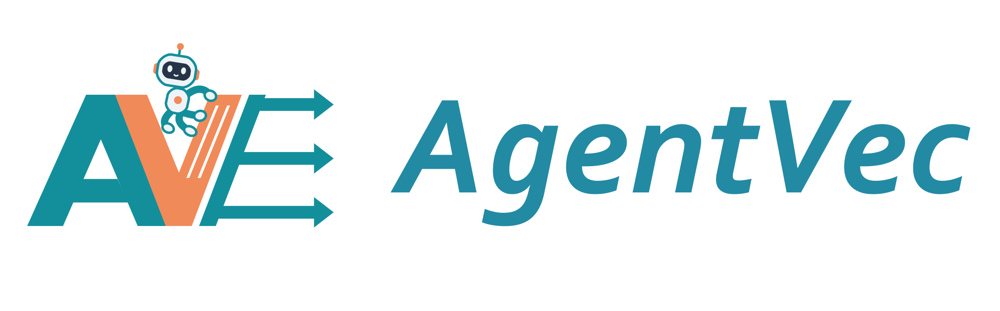
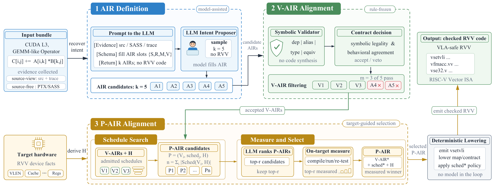
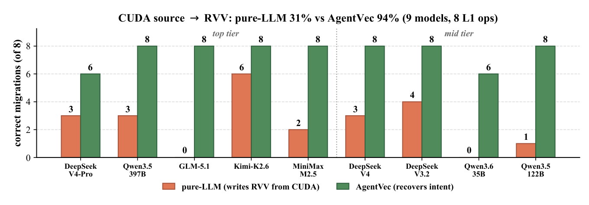
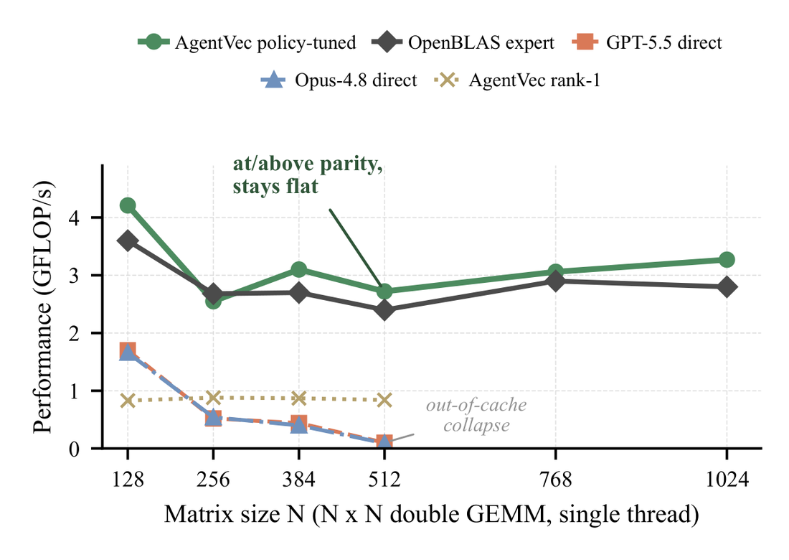
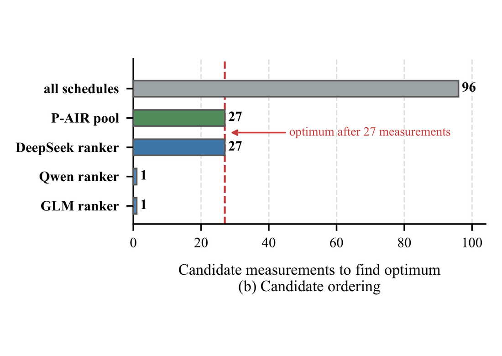

<p align="center">
  <picture>
    <source media="(prefers-color-scheme: dark)" srcset="assets/logo-dark.svg">
    <source media="(prefers-color-scheme: light)" srcset="assets/logo.svg">
    
  </picture>
</p>


<p>
  <a href="#overview">Overview</a> &nbsp;·&nbsp;
  <a href="#paper-results">Paper results</a> &nbsp;·&nbsp;
  <a href="#install">Quick start</a> &nbsp;·&nbsp;
  <a href="docs/reproduction.md">Reproduction</a> &nbsp;·&nbsp;
  <a href="results/validation/README.md">Device validation</a>
</p>

<p>
  
  
  
  <a href="LICENSE"></a>
</p>

Validated intent-driven migration of numerical kernels to RISC-V Vector and AscendC.
AgentVec separates model-supplied intent from deterministic contract checks,
target lowering and independent differential testing. It accompanies *AgentVec:
Validated Intent-Driven Migration for RISC-V Vector via Agentic-Symbolic Alignment*.

## Overview

Recover algorithmic intent into **AIR**, validate it with **V-AIR**, and restrict
schedule selection through **P-AIR** before deterministic lowering and target measurement.

<p align="center">
  <a href="assets/paper/overview.png">
    
  </a>
</p>

<p align="center"><sub>Paper Fig. 2. Model-assisted decisions connect to compiler checks and on-target measurement. Click any figure to view it at full resolution.</sub></p>

## Paper results

These figures report the manuscript experiments. The [implementation coverage](docs/paper-coverage.md)
and [v0.3.1 device checks](results/validation/README.md) describe the released code separately.

**Reliable migration from CUDA source.** Across nine models and eight L1 operators,
AgentVec achieves **94.4%** semantic pass rate, compared with **30.6%** for direct RVV generation.

<p align="center">
  <a href="assets/paper/cuda-rvv-migration.png">
    
  </a>
  <br><sub>Paper Fig. 5. Each bar counts correct migrations out of eight operators.</sub>
</p>

<table>
  <tr>
    <th width="50%">GEMM throughput</th>
    <th width="50%">Schedule selection</th>
  </tr>
  <tr>
    <td align="center" valign="top">
      <a href="assets/paper/gemm-throughput.png"></a>
      <br><sub><b>Paper Fig. 6.</b> Packing avoids the out-of-cache throughput collapse seen in direct generation.</sub>
    </td>
    <td align="center" valign="top">
      <a href="assets/paper/schedule-ranking.png"></a>
      <br><sub><b>Paper Fig. 8(b).</b> P-AIR narrows 96 schedules to 27; ranking determines how many measurements find the optimum.</sub>
    </td>
  </tr>
</table>

[Figure sources](assets/paper/README.md) · [Recorded results](results/rvv) · [Paper-to-code coverage](docs/paper-coverage.md)

## Install

Python 3.10 or newer is required.

```bash
python -m pip install -e '.[dev,remote]'
python -m pytest
agentvec --help
```

The core package has no mandatory third-party dependencies. SSH execution uses
`paramiko` from the `remote` extra. Tests run on ordinary Windows or Linux machines;
RVV compilation additionally needs a native board or cross-compiler and QEMU.

## Run a migration

Generate the six registered f32 map/reduction candidates without a model or device:

```bash
agentvec migrate --backend manual --output /external/agentvec/run-001
```

This produces **CHECKED** candidates, AIR records and independent scalar references.
To compile and validate on an RVV machine, use `--execute local --gcc gcc --qemu native`.
For an SSH board, configure the variables in [.env.example](.env.example) and use
`--execute board`. Use a new or empty run directory for each invocation.

For fresh SiliconFlow proposals, export `SILICONFLOW_API_KEY` and select an available
model explicitly:

```bash
agentvec migrate --backend siliconflow --model "$SILICONFLOW_MODEL" \
  --execute board --output /external/agentvec/run-002
```

Keys are read from the environment. Invalid responses are recorded as vetoes; they
are not replaced with a correct hand-written answer. Only candidates passing every
requested differential check receive a **VERIFIED** record.

## Schedule boundary

```bash
agentvec schedules --hardware configs/rvv-k1.example.json \
  --output /external/agentvec/admitted.json
```

This enumerates the K1 study's admitted GEMM tuples. It does not time them.
The optional `--ranking` accepts a JSON object containing `ranked_ids`; the ranker
cannot modify a tuple. Full GEMM measurement drivers and recorded-measurement
replays are described in [experiments](experiments/README.md).

## Composite AIR graphs

```bash
agentvec dag --example softmax --fuse-maps --output /external/agentvec/softmax
agentvec dag --example layernorm --execute board --output /external/agentvec/layernorm
agentvec dag --contract contract.json --proposal graph.json --output /external/agentvec/custom
```

Maps, scalar broadcasts and reductions form a checked SSA graph. The compiler
checks dependencies and shapes, derives a topological order, and optionally fuses
single-use maps. The actual proposal determines the generated code. Softmax,
LayerNorm, RMSNorm and min–max normalization have independent numerical references.
See [graph contracts and validation](docs/dag.md) for the supported language and ABI.

## AscendC backend

```bash
agentvec ascend --output /external/agentvec/ascend-projects
agentvec ascend --ops saxpy,sdot,sgemv,sgemm --profile paper \
  --execute ascend --output /external/agentvec/ascend-measured
```

Generation exports device kernels, host references and CANN build projects. The
registered backend has ten f32 templates and explicit vetoes for two triangular
solves. The [Ascend guide](docs/ascend.md) describes SDK setup, schedule/shape bounds,
timing boundaries, archived paper sources and measurement records. An exported
project is CHECKED; only complete build and target validation establish VERIFIED.

## Repository layout

```text
src/agentvec/       Core AIR, DAG validation/lowering, CLI, API and SSH clients
src/agentvec/ascend/ Registered AscendC backend, host references and CANN runner
experiments/        Study-specific drivers and external-workspace configuration
benchmarks/         Measurement guidance and run-summary tools
benchmarks/dag/     Independent branch/join and multiple-output validation
benchmarks/ascend/  Paper source projects, source contracts and probe protocols
configs/            Hardware profile examples
schemas/            Structured intent response schema
examples/           Minimal checked-intent example
tests/unit/         Parser, legality, numerical comparator, API and ranking tests
tests/integration/  Pipeline boundary tests
tests/native/       Executable RVV edge cases and guarded NRM2 checks
tests/rvv_difftest/  Independent harness and distributed kernel corpus
results/rvv/        Preserved measurement summaries from the downloaded artifact
results/ascend310p/ Preserved Ascend probe measurements and source/record provenance
results/validation/ Current-release correctness and build-validation summary
docs/               Architecture, configuration, reproduction and paper coverage
scripts/            Compatibility wrappers for experiment entry points
.github/            CI and contribution templates
```

## Scope and reproduction

The `migrate` command covers registered unit-stride f32 kernels, with f32/i32
primitives in the core emitter. `dag` supports scalar/common-length vector graphs;
`ascend` uses registered f32 BLAS contracts. The f64 BLAS and RVV GEMM studies retain
specialized adapters. See the [paper-to-code map](docs/paper-coverage.md) for supported
forms, independent-evidence boundaries and the distinction between archived and
newly validated results.

The [0.3.1 validation record](results/validation/README.md) covers native RVV checks,
package tests, and all ten emitted AscendC templates on Ascend310P1 / CANN 8.0.RC3.
The Ascend acceptance run passed 30 shapes and 90 rounds against the host references.

[Reproduction guide](docs/reproduction.md) · [Configuration](docs/configuration.md) ·
[Architecture](docs/architecture.md) · [Contributing](CONTRIBUTING.md)

Original measurements remain unchanged. New tests and outputs belong in an external
run directory; a correctness smoke test does not reproduce the paper's performance
or multi-model statistics.

## License and citation

MIT; see [LICENSE](LICENSE). Citation metadata is in [CITATION.cff](CITATION.cff).
