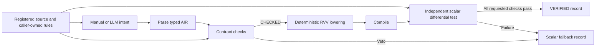

# Implementation architecture

The installed `agentvec` package provides a checked path for registered, disjoint,
unit-stride map and reduction kernels. Research drivers live outside the package.

`air.py` stores the semantic expression, rules, memory access and validity. These
correspond to the paper's S, R, M and V; Python field names retain `s_algo`, `c_phy`,
`m_map` and `v_meta` for compatibility with the released artifact.

The proposer cannot assign alias, dependence, bounds, or verification status. The
registered pipeline supplies these rules. The formula parser consumes the entire
expression and accepts no indexing, division, arbitrary calls or extra statements.
This parser is not a C/PTX static analyzer.

`guard.py` checks the supported contract and returns CHECKED. `lowering.py` repeats
the checks on entry so a forged or modified validity field does not bypass them.
Floating-point sums require permission to reassociate. The core currently emits
f32/i32, LMUL=1, unit-stride kernels; unsupported forms are vetoed explicitly.
The f64 BLAS templates in `blas_lower.py` are separate operator-specific emitters.

The migration runner compares generated code with a registered scalar implementation
that is independent of the proposed intent. The scalar AIR interpreter is useful
for testing lowering, but cannot establish that the LLM recovered the source intent.
Generated C hashes connect the candidate record to the executed binary's source.

Reduction accumulators retain inactive tail lanes before the final full-width fold.
This follows the RVV intrinsic distinction between default tail-agnostic behavior
and explicit `_tu` variants; see the [RVV intrinsic specification](https://github.com/riscv-non-isa/riscv-rvv-intrinsic-doc/blob/main/doc/rvv-intrinsic-spec.adoc).
Min/max use their mathematical identities, including empty-input identities.

`symbolic_align.py` and `schedules.py` implement the GEMM schedule boundary. They
admit 27 of the study grid's 96 tuples under the K1 profile. Ranking accepts IDs
only: invalid and duplicate IDs are recorded and ignored, and omitted legal IDs
are appended in deterministic order. Enumeration itself does not compile or time
a kernel. The study-specific GEMM measurement and replay drivers remain separate.

`dag.py` adds typed SSA graphs over vector maps, scalar broadcasts and reductions.
The independent contract describes inputs, outputs, finite domains and tolerances.
Topology and extent checks run again at lowering. `dag_lowering.py` emits the actual
proposed computation, optionally fusing single-use maps; `dag_pipeline.py` validates
the four bundled composites against separately written references.

`ascend/` contains the registered AscendC retargetability backend. It checks the
registered semantic contract and actual UB/schedule bounds, exports device/host
projects, then accepts only complete device checks with matching source hashes.
The original source and measurement artifacts are kept separately from generated
current-run outputs. See [graphs](dag.md), [Ascend](ascend.md), and
[paper-coverage.md](paper-coverage.md) for each backend's supported boundary.
